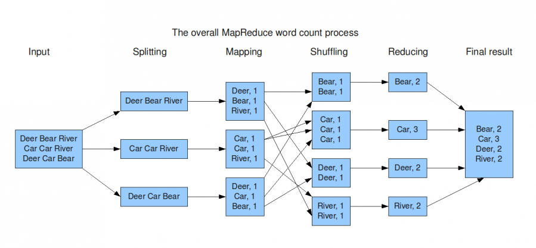

---
output:
  revealjs::revealjs_presentation:
    pagetitle: R und Big(ger than memory) Data
    transition: fade
    center: false
    theme: white
    highlight: tango
    css: zireveal.css
    fig_width: 8
    fig_height: 4.5
    fig_caption: false
    self_contained: true
---

```{r setup, include=FALSE}
library("tidyverse")
library("zicolors")
library("knitr")
library("forcats")
library("zicolors")
library("biglm")
knitr::opts_chunk$set(echo = FALSE)
options(knitr.kable.NA = '')
```


## <br><br><br>R und Big(ger than memory) Data 

**Dr. Lars E. Kroll** \
*Fachbereich Data Science und Versorgungsanalysen*


## Hintergrund{data-background="#0086C5"}

## Was ist das Problem?

**R** ist bei kleinen Datensätzen sehr schnell, weil es alle Daten im Arbeitsspeicher des Computers hält.

Dies wird, wenn Datensätze analyisiert werden sollen, bei Arbeit mit **R** wird im Vergleich zu Paketen wie *sas* oder *SPSS* problematisch.

Diese Präsentation führt in Techniken zur Analyse von Datensätzen ein, die auf die Festplatte eines Computers, nicht aber komplett in seinen Speicher passen.


## Technischer Hintergrund

```{r echo=FALSE, message=FALSE, warning=FALSE}
data.frame("Typ"=c("RAM","HD","SSD","M2"),"Geschwindigkeit"=c(21.3,.220,.530,5)) %>% 
  ggplot(aes(x=fct_reorder(Typ,Geschwindigkeit),y=Geschwindigkeit,fill=Typ))+geom_bar(stat="identity",show.legend = F) + theme_zi_titels() + scale_fill_zi("main4colors")  + labs(x="",y="Geschwindigkeit GB/s")
```

Arbeitsspeicher (RAM) ist *100 mal schneller* als eine klassische Festplatte und *4 mal* schneller als der schnellste M2 PCIE4 SSD Speicher. Je mehr Daten im RAM analysiert werden, desto besser.

## Lösungsansätze

Um große Datensätze mit R zu bearbeiten stehen verschiedene Lösungsansätze zur Verfügung:

**Gute Lösungen** aber heute nicht Thema:

- Mehr RAM kaufen (bis zu 256GB sind aktuell möglich)
- Arbeit mit Zufallsstichproben und verkleinerten Datensätzen

**Heute Thema**

- Arbeiten mit R und `DBI` direkt auf Datenbanken
- Parallelisierung von gestückelten Daten

## Arbeit mit Datenbanken{data-background="#0086C5"}

## R und Datenbanken

Grundsätzlich können Daten, die bereits in einer relationalen oder nichtrelationalen Datenbank vorgehalten werden, immer direkt über geeignete Frontends analysiert werden.

R bietet mit dem Paket DBI aber ebenfalls eine Schnittstelle, um als Frontend einer Datenbank zu fungieren [(mehr Informationen)](https://db.rstudio.com/).

R ist aber auch in der Lage, Datensätze ohne Installation zusätzlicher Software in eine Datenbank auszulagern und auf dieser zu analysieren. Dadurch ist eine Nutzung von R mit Datensätzen möglich, die nicht in den Speicher des lokalen PC passen.

Das Vorgehen soll exemplarisch mit dem Beispieldatensatz *nycflights13* veranschaulicht werden.

## Testdatensatz *nycflights13*

Der Testdatensatz umfasst `r nrow(nycflights13::flights)` Inlandsflüge, die im Jahr 2013 von den Flughäfen der Stadt New York City in Richtung von Zielen innerhalb der USA gestartet sind.

Als zusätzliche Metadaten sind Informationen zu Airlines, Flughäfen, Wetter, and Flugzeugen enthalten. 

Der Datensatz passt zwar in der Regel in den Arbeitsspeicher, alle Techniken funkionieren aber auch mit größeren Datensätzen.

## Erzeugen der Testdateien als csv

Hier werden aus dem mitgelieferten Beispieldaten csv Dateien erstellt und gespeichert. In der Realität liegen wahrscheinlich bereits csv-Dateien vor, die bspw. mit dem *SQL Navigator* o.ä. aus einer DB extrahiert wurden. 

```{r echo=TRUE, message=FALSE, warning=FALSE, cache=TRUE}
library(nycflights13)
write.csv(nycflights13::airlines,"data/airlines.csv")
write.csv(nycflights13::flights,"data/flights.csv")
write.csv(nycflights13::airports,"data/airports.csv")
write.csv(nycflights13::planes,"data/planes.csv")
```

## Erzeugen einer Datenbank aus den Testdateien

Es ist mit R möglich, große csv-Dateien in einer Datenbank zu speichern, ohne sie vorher in den Arbeitsspeicher zu laden. 

```{r echo=TRUE, message=FALSE, warning=FALSE}
# Create an empty DB
library("RSQLite")
mylocaldb <- dbConnect(RSQLite::SQLite(), "data/mylocaldb.sqlite")
for (myname in c("flights","airlines","airports","planes")) {
dbWriteTable(conn = mylocaldb, name = myname, value = paste0("data/",myname,".csv"), 
             row.names = FALSE, header = TRUE, overwrite=TRUE)  
}
```

Tabellen mit R verknüpfen:
```{r echo=TRUE, message=FALSE, warning=FALSE}
flights <- tbl(mylocaldb,"flights")
planes <- tbl(mylocaldb,"planes")
airports <- tbl(mylocaldb,"airports")
```


## Was sind die 4 Flugzeuge mit den meisten Starts in NYC 2013?
```{r echo=TRUE, message=FALSE, warning=FALSE}
flights %>% count(tailnum) %>% arrange(-n) %>% filter(tailnum!="NA") %>% 
  head(4) %>% left_join(planes,by="tailnum") %>%
  mutate(model=paste(manufacturer,model)) %>% select(Kennung=tailnum,"Starts"=n,Modell=model,Baujahr=year) %>% knitr::kable()
```

## Inlands-Flugziele von NYC mit mehr als 2500 Flügen 2013

1. Schritt: Flugrouten auszählen

```{r message=FALSE, warning=FALSE, echo=TRUE}
allflights <- flights %>% group_by(origin,dest) %>% count() %>% ungroup() %>% mutate(id=row_number())
plotdata <- bind_rows(
  allflights %>% select(id,n,faa=origin) %>% 
    left_join(.,
              airports %>% select(faa,lat,lon)) %>% 
    collect() %>% mutate(type="origin"),allflights %>% select(id,n,faa=dest) %>% left_join(.,airports %>% select(faa,lat,lon)) %>% collect() %>% mutate(type="destination"))
```

2. Schritt: Geodaten laden und Ergebnisdatensatz erstellen

```{r message=FALSE, warning=FALSE,  echo=TRUE, cache=TRUE}
library("sf")
library("rnaturalearth")
world <- ne_countries(scale = "medium", returnclass = "sf")
connections_sf <- plotdata %>% filter(!is.na(lat)) %>% st_as_sf(coords = c("lon", "lat"), crs = 4326, agr = "constant") %>% group_by(id) %>%
  summarise(do_union = FALSE) %>%
  st_cast("LINESTRING") %>% left_join(plotdata %>% select(id,n))
```

---

3. Schritt: Ergebnis mit ggplot und Hintergrundkarte plotten

```{r echo=TRUE, message=FALSE, warning=FALSE, fig.height = 3, fig.width = 5,fig.align = "center", cache=TRUE}
ggplot(connections_sf) + theme_void() + geom_sf(data=world,fill="lightgrey") + 
  geom_sf(data=.%>% filter(n<=2500),show.legend = F,color="darkgrey")+ 
  geom_sf(data=.%>% filter(n>2500),show.legend = F,color="darkred",size=1.5) + 
  coord_sf(expand=FALSE,
           xlim =c(st_bbox(connections_sf)[1],st_bbox(connections_sf)[3]),
           ylim=c(st_bbox(connections_sf)[2],st_bbox(connections_sf)[4]))
```

## Regressionsanalyse

**Fragestellung:**  \
*Ist ein Flug von NYC umso pünktlicher, je weiter sein Ziel entfernt ist?*

Es gibt verschiedene Pakete. Wir haben uns für das Paket *biglm* entschieden, dass die Daten Stückweise in den Arbeitsspeicher des PCs lädt.

Es gibt auch Ansätze, Modelle direkt auf Datenbanken zu rechnen. Hier werden alle Arbeitsschritte in SQL übersetzt und anschließend auf dem Backend ausgeführt. Dies ist bisher aber nur für wenige Modelle sinnvoll möglich. Mehr dazu hier: [tidymodels](https://tidymodels.github.io/)

---

**Ergebnistabelle:**

```{r echo=TRUE, message=FALSE, warning=FALSE, cache=TRUE}
model <- flights %>% 
  mutate(distance=distance/1000,
         quartal=as.character(floor(month/4)+1)) %>% 
  biglm::biglm(dep_delay~1+distance+quartal, data=.)
broom::tidy(model) %>% knitr::kable() 
```


## Geschwindigkeitsvorteil durch Datenbank?

Nein, die Arbeit mit einer DB als Backend ist **deutlich langsamer** als die Arbeit im Arbeitsspeicher! 

```{r echo=TRUE, message=FALSE, warning=FALSE, cache=TRUE}
flights_ram<- flights %>% collect()
start_time <- Sys.time()
result <- flights_ram %>% group_by(carrier) %>% summarise(Mean_delay=mean(sched_dep_time-dep_time,na.rm=T))
end_time <- Sys.time()
t_ram <- round((end_time - start_time)*1000)
start_time <- Sys.time()
result <- flights %>% group_by(carrier) %>% summarise(Mean_delay=mean(sched_dep_time-dep_time,na.rm=T)) %>% collect()
end_time <- Sys.time()
t_sqlite <- round((end_time - start_time)*1000)
as.data.frame(cbind("Method"=c("RAM","SQLITE"),"Result (msec)"=c(t_ram,t_sqlite))) %>% knitr::kable()

```


## Zwischenfazit Datenbanken

- Mit **Datenbanken als Backend für R** lassen sich die meisten deskriptiven Aufgaben  bearbeiten.
- Hierbei kann die vielen bekannte *tidyverse* Syntax genutzt werden.
- Es stehen Schnittstellen für die meisten Backends zur Verfügung, mehr dazu [hier](https://db.rstudio.com/).
- Die Nutzung von Datenbanken als Backend bietet gegenüber der Arbeit im Arbeitsspeicher jedoch **Geschwindigkeitsnachteile**. 
- Datenbanken sollten für Analysen nur genutzt werden, wenn die Daten nicht in den Arbeitsspeicher passen.

## Arbeit mit "Big Data Lösungen"{data-background="#0086C5"}

## Was machen "Big Data Lösungen" anders?

Das Konzept MapReduce ist die Basis vieler "Big Data Lösungen"

Relationale Datenbanken gehen Tabellen i.d.R. zeilenweise durch, um ein Ergebnis zu generieren. 

Demgegenüber setzen Lösungen für verteiltes Rechnen auf Varianten des von Google entwickelten Programmierschemas **"MapReduce"**.

{height=250px}
(Quelle: [Groningen 2009](https://blog.trifork.com/2009/08/04/introduction-to-hadoop/))

## Prinzip

Eine *Datenbank* arbeit in der Regel seqeuntiell und benötigt für **n Zeilen n Arbeitschritte**, um ein Ergebnis zu generieren. 

Ein *verteilter Ansatz* benötigt zwar mehr Schritte (n+m+r mit m:Mapping, r:Reduktion) verteilt diese aber auf mehre Knoten. 

Die **Analysezeit**  steigt im Fall der *Datenbanken* also proportional zur Anzahl der Zeilen, während sie bei *MapReduce-Ansatz* proportional zur Zahl der Knoten sinkt. 

**Je größer n wird, desto mehr Vorteile hat MapReduce gegenüber eine sequentiellen Verarbeitung.**

## Hypotetischer Geschwindidkeitsvergleich

Je höher die Zahl der Knoten, desto größer ist der Overhead durch den Algorithmus, aber auch der potentielle Geschwindigkeitsvorteil bei sehr großen Datenmengen. 

```{r message=FALSE, warning=FALSE}
tibble("Row"=seq(3,10,1)) %>% mutate(Zeilen = 10^Row, Dauer_pro_Zeile=.001,Knoten=6,Maps=Knoten,Reduces=Knoten,Overhead=.1*(Maps+Reduces),Dauer_DB=Zeilen*Dauer_pro_Zeile,Dauer_MR=(Zeilen/Knoten)*Dauer_pro_Zeile+Dauer_pro_Zeile*Maps+Dauer_pro_Zeile*Reduces+Overhead,Zeilen=format(Zeilen,scientific = F,big.mark = ".",decimal.mark = ","),Unterschied=paste(round(100*(Dauer_MR/Dauer_DB)),"%"),Dauer_MR=format(round(Dauer_MR),big.mark = "."),Dauer_DB=format(round(Dauer_DB),big.mark = ".",scientific = F)) %>% select(-Row,-Maps,-Reduces,Overhead) %>% knitr::kable(digits = 4)
```

*Annahme:* \
Der Overhead für Mapreduce Operationen entspricht etwa 0.1 * (Maps+Reduces) = 0.1 * 2 * Knoten


## Softwarebibliotheken

**Hadoop** verteiltes Dateisystem auf Basis des MapReduce Prinzips, dass nach dem Prinzip eines Festplatten-RAID Systems funktioniert.

**Apache Spark** ist ein Framework für Cluster Computing das auf Hadoop basiert. Es setzt  statt auf Festplattenspeicher aber konsequent auf die Analyse der Daten im Arbeitsspeicher. 

**CUDA** ist eine vergleichbare Implementierung zum parallelen Ausführung gleichförmiger Aufgaben auf den Kernen von Grafikprozessoren (GPU). 

**Disk.Frame** und **dask** sind R (bzw. Python) Bibliotheken, die für die hochparallelisierte Arbeit auf lokalen Rechnern nutzbar sind.

**Tensorflow GPU**, **RAPIDS** und **BlazingSQL** nutzen GPUs für noch höhere Geschwindigkeiten. Sie sind nur in Python voll implementiert und erfordern teilweise Linux als OS.

## Die Bibliothek disk.frames für R

Das Paket *disk.frame* wurde entwickelt, um mit R Daten paralelisiert zur analysieren, die nicht in den Arbeitsspeicher (RAM) passen. Es teilt den Datensatz dazu in Teildatensätze auf.

Diese Teildatensätze werden in einem Ordner gespeichert und können gemeinsam mit R wie ein großer Datensatz analysiert werden.

Der Ansatz von *disk.frame* ähnelt dabei Apache Spark, Dask und ähnlichen Systemen. Er ist besonders für medium sized data geeignet, die nicht in den RAM, wohl aber auf die Festplatte passen. 

Für medium sized data, ist die Nutzung eines Computer-Clusters oft nicht nötig und der.

## Wichtige Konzepte

*disk.frame* nutzt wie die meisten Frameworks für verteilte Analysen die Konzepte *chunks* und *shards* bei der Datenaufteilung. Der Umgang damit ist zentral, für die Performance des Frameworks.

Die Teildatensätze werden als "chunks" bezeichnet. Sie habnen eine feste Größe. Ihre Größe kann **entweder** durch den Parameter *Anzahl der Chunks* **oder** durch den Parameter *Chunk-Größe*  beeinflusst werden. 

Falls bestimmte Partitionen der Daten regelhaft vorkommen, bietet es sich an, die Teildatensätze in **shards** aufgrund eines sog. sharding-keys zu gruppieren. Dadurch können große Teile der Daten herausgefiltert werde und die Analyse wird beschleunigt. Dies funktioniert umso effektiver, je gleicher sich die Werte des sharding keys in den Daten verteilen (bspw. KV, Quartal, BSNR bei amb. Abrechnungsdaten). 

## **disk.frame** Geschwindigkeitstest

Die chunk-Anzahl erntspricht hier der Anzahl der CPUs (max. Performance).

```{r echo=TRUE, message=FALSE, warning=FALSE}
suppressPackageStartupMessages(library(disk.frame))
setup_disk.frame() # 6 Workers
```
```{r echo=TRUE, message=TRUE, warning=FALSE}
dfflights <- csv_to_disk.frame(
  "data/flights.csv", outdir = "tmp_flights.df",  overwrite = T)

start_time <- Sys.time()
result <- flights %>% group_by(carrier) %>% summarise(Mean_delay=mean(sched_dep_time-dep_time,na.rm=T)) %>% collect()
end_time <- Sys.time()
dauer <- round((end_time - start_time)*1000)
```

Die Analyse dauert mit `r paste(dauer,"ms")` zwar länger als im RAM (~150 ms), aber teilweise nur etwa halb so lange, wie mit SQLite (~300/700 ms). 


## Logistische Regression

*Frage: Haben Nachtflüge häufiger >10 Min. Verspätung?*

```{r  echo=TRUE, message=TRUE, warning=FALSE}
dfflights <- csv_to_disk.frame("data/flights.csv", outdir = "tmp_flights.df",  overwrite = T)
dfflights %>% mutate(delayed=dep_delay>10,
                     distance=distance/1000,
                     nightstart = (dep_time<600) |(dep_time>2000)) %>%
  dfglm(delayed~1+distance+nightstart ,data=., family=binomial()) %>%
  broom::tidy(exponentiate=TRUE,conf.int=TRUE) %>% knitr::kable(digits = 3)
```

*Man sollte lieber tagsüber von NYC starten...*

## Fazit

- Insgesamt bietet R **verschiedene Möglichkeiten**, mit großen Datensätzen zu arbeiten. 
- Ein einfacheste Weg ist die Nutzung einer SQLite **Datenbank als Backend**.
- Mit der neuen R-Bibliothek "disk.frame" ist demgegenüber aber ein **zusätzlicher Performancegewinn** zu erzielen.
- Hinsichtlich der Nutzbarkeit **statistischen Verfahren** bestehen bei großen Datensätzen einige Limitationen, da nicht alle Modelle implementiert sind.
- Viele **Viele Regressionsanalysen** sind möglich (alle glm-Modelle, wie lineare und logistische Regression)


